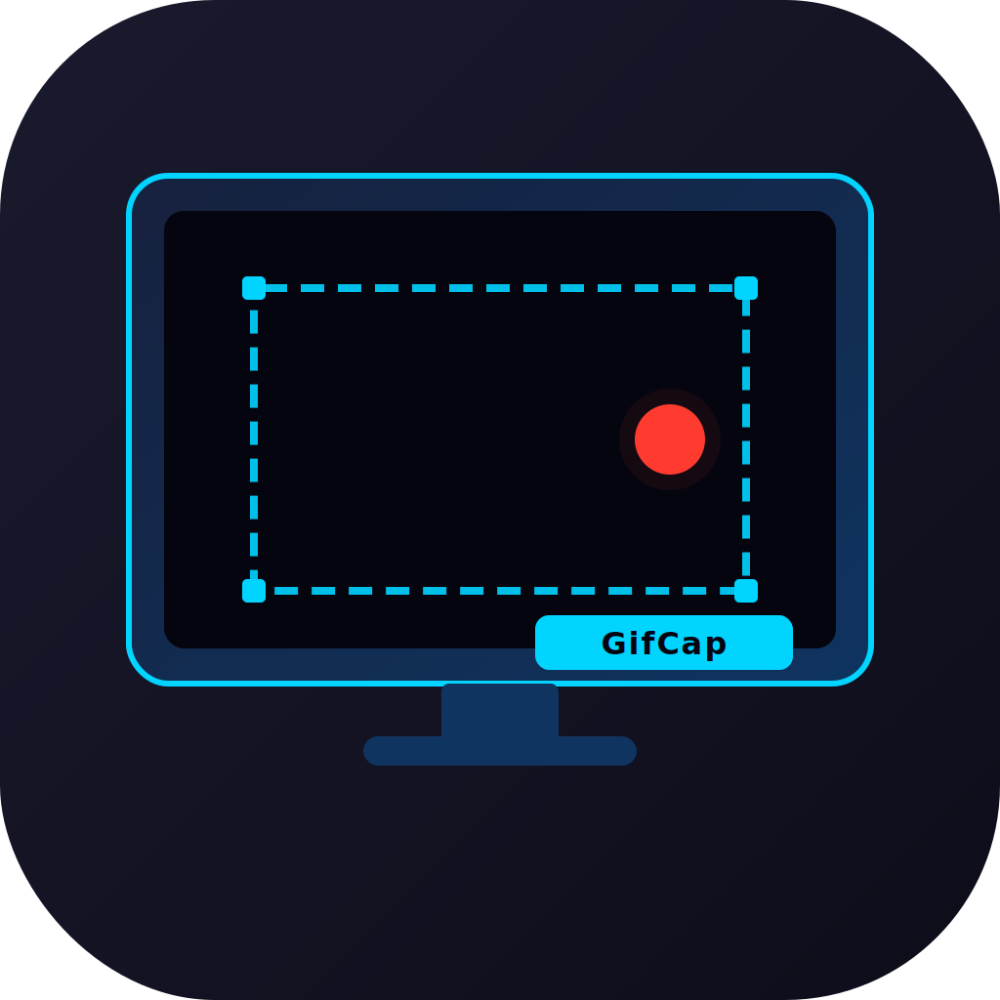

# GifCap

A lightweight macOS screen recorder that captures any region of your screen and exports it as an animated GIF.



## Features

- **Region capture** — drag to resize the capture window to any area of your screen
- **Transparent overlay** — the capture area is click-through so you can interact with anything underneath while recording
- **One-click export** — encoding runs in parallel (rayon) for fast GIF output
- **Native save dialog** — saves with a timestamped filename (`gif-YYYYMMDD-HHMMSS.gif`)
- **Native traffic light buttons** — minimize, close, and move the window like any macOS app
- **Stable permissions** — signed with a consistent `io.gifcap` identifier so macOS remembers your screen recording grant across updates

## Requirements

- macOS 13.0 or later
- Screen & System Audio Recording permission (the app will prompt on first launch)

## Install

### Option A — Download the pre-built app

1. Download `GifCap.app` from the [latest release](https://github.com/alokm/gifcap/releases)
2. Move it to `/Applications` or anywhere on your Mac
3. Sign it locally so macOS trusts it:
   ```
  xattr -cr /path/to/GifCap.app
  codesign --force --deep --sign - --identifier "io.gifcap" /path/to/GifCap.app
   ```
4. Launch GifCap — it will ask for Screen Recording permission on first run
5. Open **System Settings → Privacy & Security → Screen & System Audio Recording**, enable **GifCap**, then relaunch

### Option B — Build from source

**Prerequisites**

- [Rust](https://rustup.rs) (1.77+)
- [Node.js](https://nodejs.org) (18+)
- Xcode Command Line Tools: `xcode-select --install`

**Steps**

```bash
git clone https://github.com/alokm/gifcap.git
cd gifcap
npm install
npm run build
```

This builds the app, injects the required `NSScreenCaptureUsageDescription` into `Info.plist`, codesigns it with the `io.gifcap` identifier, and copies the final `GifCap.app` to `~/Desktop/caps/`.

## Usage

1. Launch `GifCap.app`
2. Resize and position the capture window over the area you want to record
3. Click **Record** in the top bar
4. When done, click **Stop**
5. Preview the GIF, then click **Save GIF…** to export

## Development

```bash
npm install
npm run dev      # starts Tauri dev mode with hot-reload
```

The project is structured as:

```
src/                  # TypeScript frontend (Vite)
  capture-window/     # Overlay capture UI
  preview-window/     # Post-capture preview & save
  preferences/        # Settings panel
src-tauri/            # Rust backend (Tauri 2)
  src/capture/        # ScreenCaptureKit backend (macOS)
  src/compression/    # GIF encoding with rayon parallelism
  src/commands/       # Tauri command handlers
  src/platform/       # macOS-specific helpers (click-through watcher)
scripts/
  post-build.sh       # Injects Info.plist keys, codesigns, copies .app
```

## Permissions

GifCap uses **ScreenCaptureKit** (macOS 13+) for screen capture. The first time you launch the app it will trigger a system permission prompt. Grant access in **System Settings → Privacy & Security → Screen & System Audio Recording**.

The app does **not** record audio — the microphone and system audio permission is explicitly disabled.

## License

MIT
